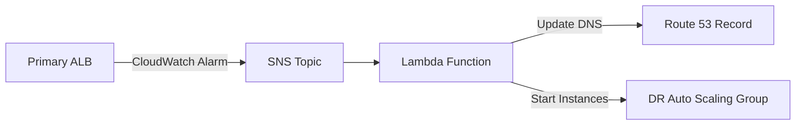

# Automated Multi-Region Disaster Recovery on AWS

This Terraform project implements a fully automated DR system that uses CloudWatch, SNS, Lambda, and Route 53 to switch traffic to a secondary region automatically when the primary region becomes unhealthy.

## Architecture

- **Primary Region**: us-west-2
- **DR Region**: eu-west-2
- **Automation Region**: ca-central-1



## What gets deployed

- VPC, public/private subnets, internet gateways, and NAT gateways in both application regions.
- Primary public ALB, private launch-template instances, and Auto Scaling Group with two running web instances across AZs.
- DR public ALB, private launch-template instances, and Auto Scaling Group initially set to zero desired instances.
- CloudWatch alarm in the primary region that watches the primary ALB healthy target count.
- SNS alarm topic in the primary region that invokes the failover Lambda in the automation region.
- Lambda function that points Route 53 to the DR ALB, scales the DR ASG to one instance, and scales the primary ASG to zero.
- Optional notification SNS topic/email subscription for failover completion messages.

## Configure

Update `terraform.tfvars`. Use a dedicated subdomain so this stack does not touch an existing production `www` record:

```hcl
hosted_zone_name   = "neatfleets-services.com"
record_name        = "dr.neatfleets-services.com"
instance_type      = "t3.micro"
primary_key_name   = "ansible-key"
dr_key_name        = "london-key-pair"
# notification_email = "you@example.com"

# Optional. If omitted, instances launch without SSH keys.
# key_name         = "shared-key-name"
```

The hosted zone must already exist as a public Route 53 hosted zone in the AWS account used by Terraform. This stack manages only `record_name`; it does not manage `www.neatfleets-services.com`.

## Deploy

```bash
terraform init
terraform validate
terraform plan -input=false -out=tfplan
terraform apply "tfplan"
```

After apply, confirm the primary ALB output and `record_name` respond, then test failover by forcing the primary target group unhealthy or setting the primary ASG desired capacity to zero. The CloudWatch alarm should publish to SNS, invoke Lambda, scale the DR ASG up, and update the Route 53 A alias record to the DR ALB.

This project builds an automated multi-region disaster recovery setup on AWS. It creates a normal “primary” web stack in us-west-2, a standby disaster recovery stack in eu-west-2, and automation resources in ca-central-1.

- **Normal State**

Traffic goes to:

dr.neatfleets-services.com
That Route53 DNS record points to the primary Application Load Balancer in us-west-2.

Behind that primary ALB, Terraform creates:

A VPC
Public subnets for the ALB
Private subnets for EC2 instances
NAT gateways so private EC2 instances can install packages
A launch template
An Auto Scaling Group with 2 EC2 instances
Apache/httpd web server on each instance
A target group and listener for HTTP port 80
So when everything is healthy, users hit:

dr.neatfleets-services.com -> primary ALB -> primary EC2 web servers


- **DR Region**

In eu-west-2, Terraform creates the same kind of infrastructure:

VPC
Public/private subnets
NAT gateways
DR ALB
DR target group
DR launch template
DR Auto Scaling Group
But the DR Auto Scaling Group starts at:

desired_capacity = 0
So no DR web instances run until failover happens. This saves cost.

- **Monitoring**

CloudWatch watches the primary ALB target group. Specifically, it checks whether the primary ALB has healthy backend instances.
If the primary web servers become unhealthy and the ALB has no healthy targets, CloudWatch alarm triggers.

- **Failover Flow**

When the alarm fires:
CloudWatch Alarm -> SNS Topic -> Lambda Function

The Lambda does this:

Scales the DR Auto Scaling Group in eu-west-2 from 0 to 2.
Waits until the DR ALB has healthy targets.
Updates Route53 so:
dr.neatfleets-services.com
points to the DR ALB instead of the primary ALB.

Scales the primary Auto Scaling Group down to 0.
Sends a notification to the SNS notification topic.
After failover, traffic becomes:

dr.neatfleets-services.com -> DR ALB -> DR EC2 web servers


## - Important Limitation

This project is a DR infrastructure demo for a simple Apache web page. It does not replicate application data, databases, files, user uploads, SSL certificates, or production app state. For a real production DR system, you would also add database replication, S3 replication, certificate handling, backups, and a failback process.

## 🤝 Contribution

Pull requests are welcome. For major changes, please open an issue first.

## 👨‍💻 Author

**Joseph Mbatchou**

• DevOps / Cloud / Platform  Engineer   
• Content Creator / AWS Builder

## 🔗 Connect With Me

🌐 Website: [https://platform.joebahocloud.com](https://platform.joebahocloud.com)

💼 LinkedIn: [https://www.linkedin.com/in/josephmbatchou/](https://www.linkedin.com/in/josephmbatchou/)

🐦 X/Twitter: [https://www.twitter.com/Joebaho237](https://www.twitter.com/Joebaho237)

▶️ YouTube: [https://www.youtube.com/@josephmbatchou5596](https://www.youtube.com/@josephmbatchou5596)

🔗 Github: [https://github.com/Joebaho](https://github.com/Joebaho)

📦 Dockerhub: [https://hub.docker.com/u/joebaho2](https://hub.docker.com/u/joebaho2)

---

## 📄 License

This project is licensed under the MIT License — see the LICENSE file for details.

